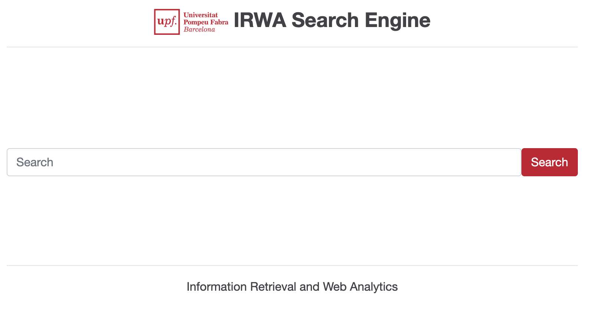

# Information Retrieval and Web Analytics (IRWA) - Final Project template

<table>
  <tr>
    <td style="vertical-align: top;">
      
    </td>
    <td style="vertical-align: top;">
      This repository contains the template code for the IRWA Final Project - Search Engine with Web Analytics.
      The project is implemented using Python and the Flask web framework. It includes a simple web application that allows users to search through a collection of documents and view analytics about their searches.
    </td>
  </tr>
</table>

----
## Project Structure

```
/irwa-search-engine
├── myapp                # Contains the main application logic
├── templates            # Contains HTML templates for the Flask application
├── static               # Contains static assets (images, CSS, JavaScript)
├── data                 # Contains the dataset file (fashion_products_dataset.json)
├── project_progress     # Contains your solutions for Parts 1, 2, and 3 of the project
├── .env                 # Environment variables for configuration (e.g., API keys)
├── .gitignore           # Specifies files and directories to be ignored by Git
├── LICENSE              # License information for the project
├── requirements.txt     # Lists Python package dependencies
├── web_app.py           # Main Flask application
└── README.md            # Project documentation and usage instructions
```


----
## To download this repo locally

Open a terminal console and execute:
```
cd <your preferred projects root directory>
git clone https://github.com/trokhymovych/irwa-search-engine.git
```

## Setting up the Python environment (only for the first time you run the project)
### Install virtualenv
Setting up a virtualenv is recommended to isolate the project dependencies from other Python projects on your machine.
It allows you to manage packages on a per-project basis, avoiding potential conflicts between different projects.

In the project root directory execute:
```bash
pip3 install virtualenv
virtualenv --version
```

### Prepare virtualenv for the project
In the root of the project folder run to create a virtualenv named `irwa_venv`:
```bash
virtualenv irwa_venv
```

If you list the contents of the project root directory, you will see that it has created a new folder named `irwa_venv` that contains the virtualenv:
```bash
ls -l
```

The next step is to activate your new virtualenv for the project:
```bash
source irwa_venv/bin/activate
```

or for Windows...
```cmd
irwa_venv\Scripts\activate.bat
```

This will load the python virtualenv for the project.

### Installing Flask and other packages in your virtualenv
Make sure you are in the root of the project folder and that your virtualenv is activated (you should see `(irwa_venv)` in your terminal prompt).
And then install all the packages listed in `requirements.txt` with:
```bash
pip install -r requirements.txt
```

If you need to add more packages in the future, you can install them with pip and then update `requirements.txt` with:
```bash
pip freeze > requirements.txt
```

Enjoy!


## Running the Web App
```bash
python -V
# Ensure Python 3.9+

cd IRWA-2025-FinalProject
source .venv/bin/activate  # or your virtualenv
pip install -r requirements.txt

export FLASK_APP=web_app.py
export FLASK_ENV=development  # optional
flask run
```

Application runs on http://127.0.0.1:5000 by default.


## Attribution:
The project is adapted from the following sources:
- [IRWA Template 2021](https://github.com/irwa-labs/search-engine-web-app)
